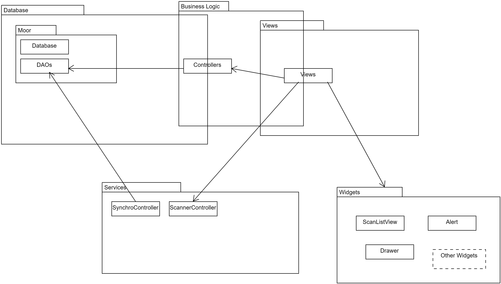

# Project Structure

This is the overview of the projects structure



## Main Parts

 - Database
 - Business Logic
 - Views
 - Services
 - UI Widgets

## Database

Persistance is implemented using moor package (now called drift)
[moor_flutter](https://pub.dev/packages/moor_flutter)

It stores the data localy in a SQLite database.

All related files are found in the database folder (/lib/database).

### database.dart 

This is where all table definitions including the Database itself can be found.

In the @UseMoor annotation are listed all Tables and DAOs.

There are additional annotations needed for the code generation:
@FutureTableNumber\
@FutureColumnNumber

These will be provided by us, and need to be left as is.

> ** Refactoring potential **
> - Extract table definitions in separate files

### xxxx_dao.dart

All Database Accessor Objects (DAOs) are defined in own files.
All functions that manipulate data are written in DAOs. No other module should access the data directly. Any new functionality (selecting data by different parameter) must be implemented here.

## Business Logic

Each module has its own controller.
Although the controllers sometimes have same names as the tables, the Controller does not represent data, but a Feature.
All related files are found in the business logic folder (/lib/buisiness_logic).

### auth_controller.dart
Authentication - login controller using Users table.

### file_controller.dart
Copies image into local directory and stores its reference into database (DeliveryImages table)

### Other files
Mostly CRUD operations for Tables, some logic included

> ** Refactoring potential **
> - a clean layer as adapter between DAOs and the business logic. DAOs should not be used directly by controllers. If at any time in the future the persistance layer (moor at the time) changes, we would now have to change all controllers. With an adapter layer, only the adapter needs to be changed.

## UI Widgets

Contains custom widgets used in the views

## Views

Each View is a separate Feature-Screen (like Android activity).

Screens for future features should also be each in its own file.

> ** Refactoring potential **
> - Business logic is not clearly separated into the Business Logic layer. Some of the business logic is implemented directly in the views. This parts should be moved to the Controllers, leaving views as pure UI code.

## Services

These are adapters for external services.

### Scanner

Plugin for communication with barcode scanner.\
Only used on devices with embedded barcode-scanner (not camera) (ie. Zebra TC52)

### Synchronisation Service

Controller that synchronises local database with a master database using REST API.

#### Incoming

Incoming datasets are received in a bulk. Up to 1000 Datasets in one json structure:

```
success: "true"/"false"
syncs:
    [
        {
            id: <sync-id>,
            uuid: <record-uuid>,
            
            // used as an identifier for synchronisation server
            lic: <software-licence>

            //identification of the user which created the record 
            //not used at the moment
            userid: <user identification>

            source: <client or app> //source of the synchronisation dataset

            // representing record type 
            // identical with table number in the Future Factory software
            type: <integer>

            deleted: 1 / 0 // 1 if the record has been deleted

            // json representation of the record 
            // different for each type 
            // mostly identical with table columns in SQLite database
            data: <json-object>
        }
        ,
        {...}
        ,
        ...
    ]
```

Each DAO has a function called "companionFromSyncJson" - which creates data structure for inserting  data into that table using given json structure. See [drift documentation](https://drift.simonbinder.eu/docs/getting-started/writing_queries/) for more information on companions.

Then a create method of DAO is called using constructed companion object. Create-functions are responsible to insert or update (replace most of the time) the data into the database.

Example:

```
_database.productsDao.createProduct(ProductsDao.companionFromSyncJson(sync.data, sync.uuid));
```

#### Outgoing

Every time a record is inserted or updated in the local database, a synchronisation record is inserted into synchronisation queue.
The synchronisation queue is implemented as SQLite table, containing uuid, type and the json representation of the synchronised dataset (SynchroUpdates).

Excample:
```
  ///hook executed when record has been changed
  Future<void> onUpdateData(Packet model) async {
      addSynchroUpdate(model.uuid, SyncType.packet, model.toJsonString());
  }

  ///hook executed when record has been deleted
  void onDeleteData(Packet model) {
    addSynchroUpdate(model.uuid, SyncType.packet, model.toJsonString(), deleted: true);
  }
```

Records from the synchronisation queue are sent to the server and then deleted from the queue.